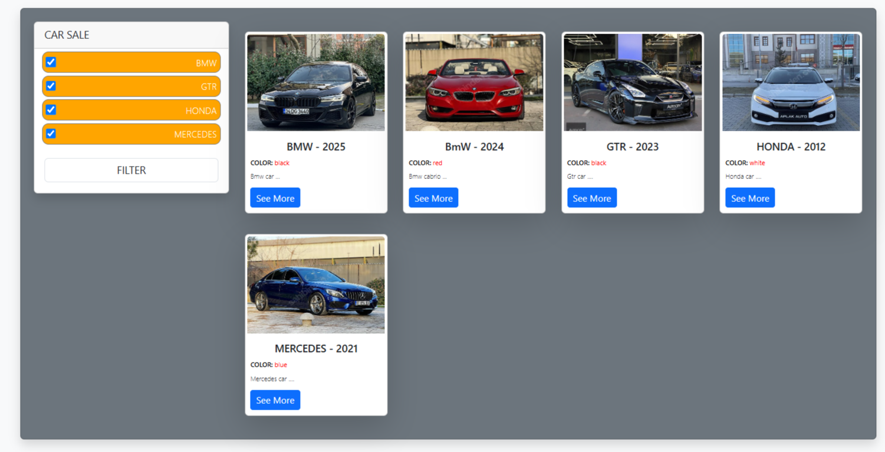
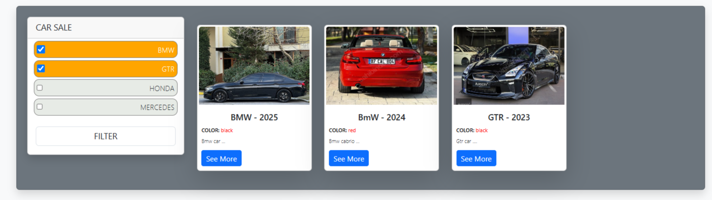

## CAR SALE
In this project, we have developed a car sale application on the web with javascript.

### 1-CAR SALE WEB APP

##### In this project, I created a car sales web page and developed the front-end. I used JavaScript to enable user interactions.

##### I implemented a sample database within JavaScript and integrated it into the web interface. The car information is displayed using a card layout. Additionally, I created a filter section that allows users to filter cars based on their models.

##### Thanks to JavaScript, users can view the available cars based on the selected model. When interacting with the filter buttons or hovering over the cards, users can see which button or card they are currently on.

#### 1.1- Application Working Logic

##### Kullanıcı seçtiği araç modeline göre istediği modeldeki araçları görebilir.
##### Kullanıcı seçtiği araç modelleri filtre bölümünde aktif halde kullanıcının anlayabileceği şekilde görünmesi sağlanır.
##### Kullanıcı bakmak istediği aracı nmevcut olduğu  kart üzerine geldiğinde üzerinde oluduğunu gösteren renk belirğin hale gelir.

##### A design has been implemented that enables slider transitions using all available car images from the database at specified time intervals.

#### 1.2-Car Sale Web Page Images

#### 1.3- Sections that can be improved

##### Additional filter sections can be added to allow users to refine their search and find the desired products more precisely.
##### A vehicle information entry screen can be implemented, enabling users to add products to the database.
##### By designing a database with .NET Core, user-submitted vehicle information can be stored directly in the database, and the web page can retrieve and display data dynamically from the database.